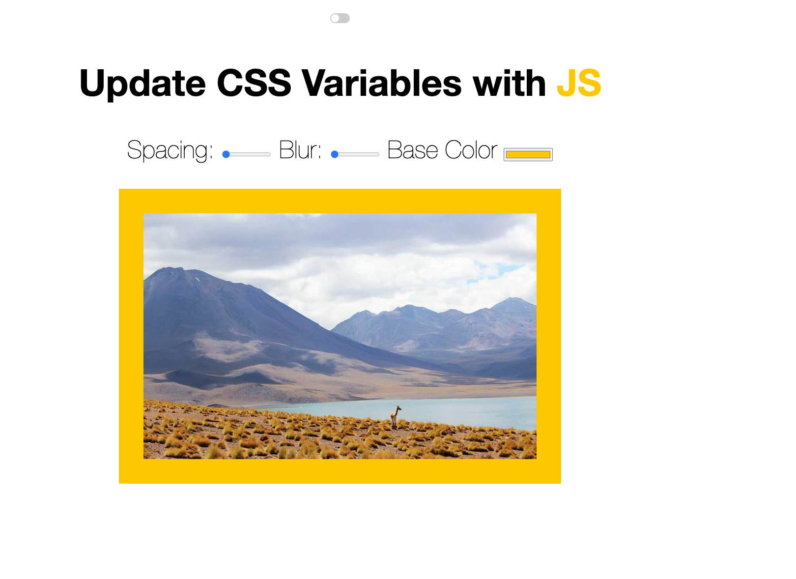

### Day 3 is about changing CSS styling with using JavaScript. Image spacing, backgroud color and blur filtering set by the elements added to web app.
### My updates
- Added dark/light theme toggle

- If you want to try the app visit the link:
https://javascript30challenge-day3.netlify.app/

#### Web App looks like this in dark theme:

#### Web App looks like this in dark theme:

