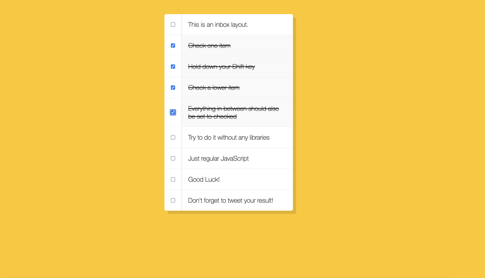

### Day 10 is about using checkboxes
####  When a user clicks a checkbox, holds Shift, and then clicks another checkbox a few rows down, all the checkboxes inbetween those two checkboxes should be checked.

#### You can try this app with the link:
https://javascript30challenge-day10.netlify.app/

#### This is the preview of application

