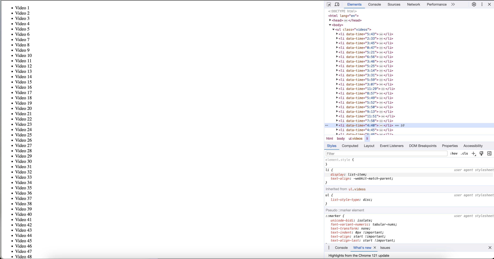

### Adding Up Times with Reduce
#### In this project, the time for each video is given as min:sec in HTML. The task is to find out total time contains how many hours, mins and secs.

#### Used methods
- map, reduce

#### You can try this app with the link:
https://javascript30challenge-day18.netlify.app/

#### This is the preview of the application:

#### Do not forget to open the console!