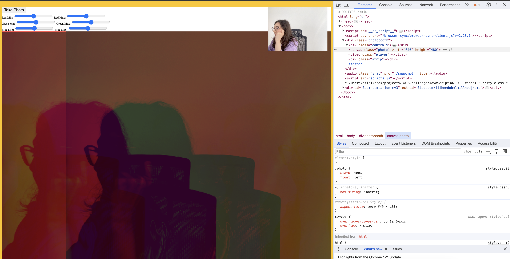
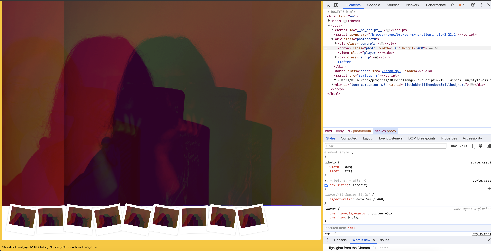

### Photobooth with JavaScript

```
npm install
npm start 

```

- This application runs on the user's computer, that is, localhost.
<<<<<<< HEAD
- User can take photo using computer's camera and download it. Taken photos have showed under the canvas. One of them clicked, photo download.
- Color intervals can be adjusted by the user using progress bars.


#### You can try this app with the link:
https://javascript30challenge-day19.netlify.app/


#### This is the preview of the application:


#### This is the preview of the application after taken photos:


=======
- You can take photo using computer's camera and download it. Taken photos have showed under the canvas. One of them clicked, photo download.
>>>>>>> parent of 3a59360 (Update readme)
