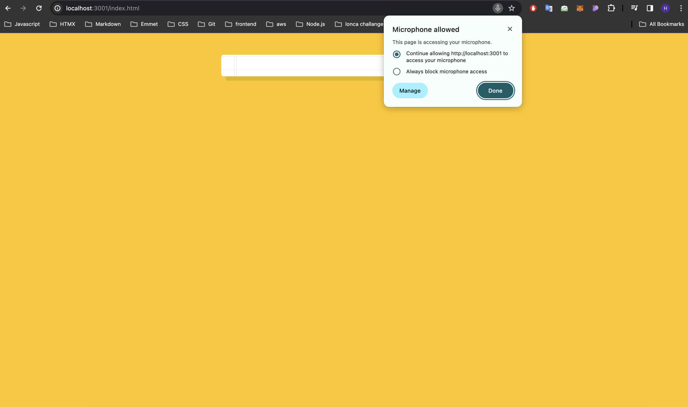
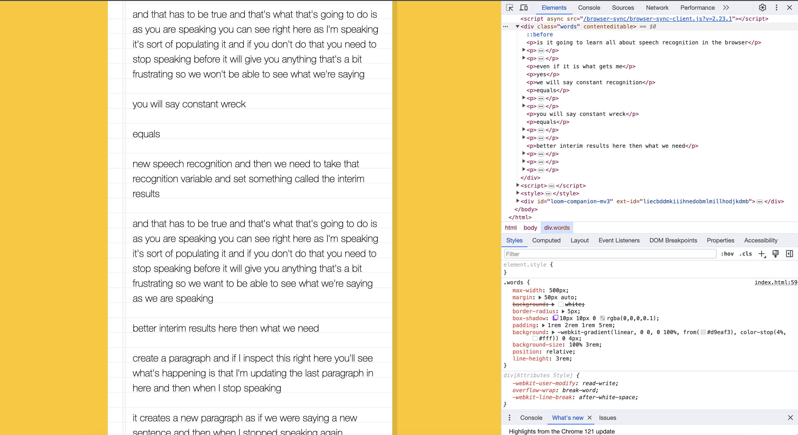

### Speech Detection
- This application allows users to see the text of what they say aloud
- Each sentence spoken by the user is detected and displayed in a separate paragraph
- To use the application, you need to grant permission for accessing the microphone as requested by your browser.

##### Go to /20-Speech Detection directory and run
```
npm install
npm start
```


#### You can try this app with the link:
https://javascript30challenge-day20.netlify.app/

#### User asked to allow microphone:


#### Created p element when user take breaks:


#### User can edit the senctences:

