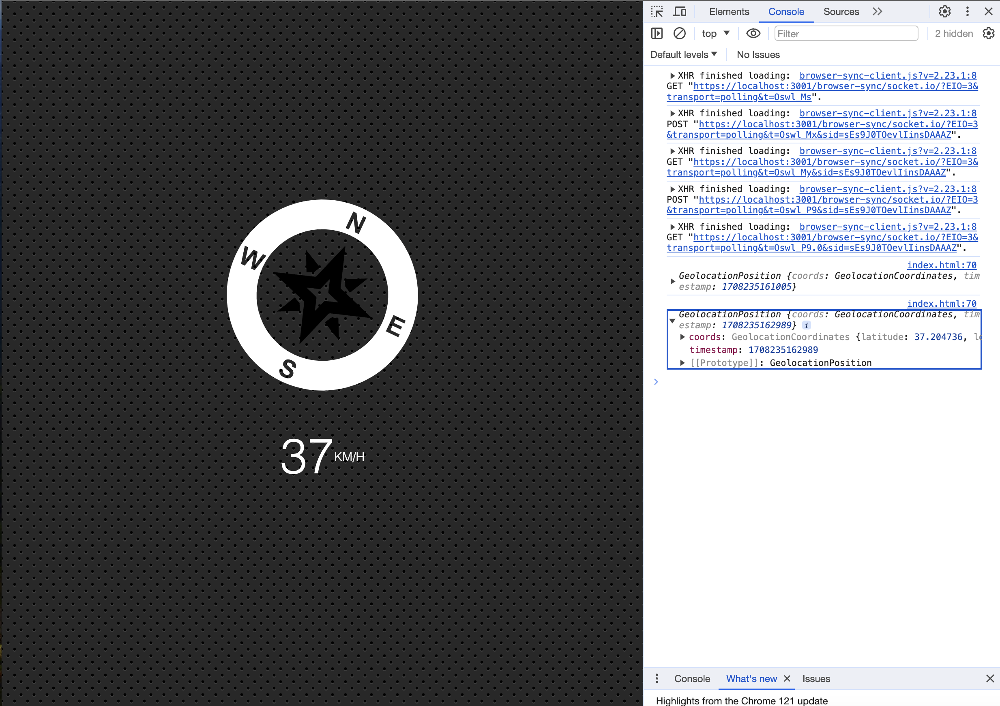

### Geolocation based Speedometer and Compass
#### This project tracks the user's location and shows their speed and direction of movement on the compass.
- Used the Geolocation API to continuously monitor the device's position
- Can be used in applications which require real-time tracking of the user's location and orientation, such as navigation or location-based services.

##### Go to /21-Geolocation directory and run
```
npm install
npm start
```
#### You can try this app with the link:
https://javascript30challenge-day21.netlify.app/

#### This is the preview of the application:

