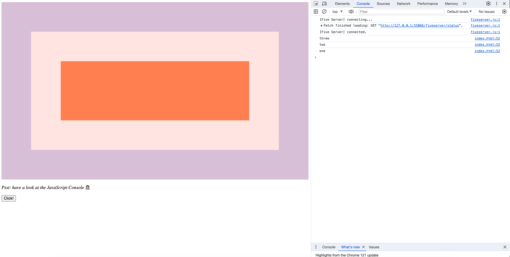

### Event Capture, Propagation, Bubbling and Once
- Nested elements are triggered from the inside outwards. When set the capture: true, event starts from the outermost element and propagates inwards to the innermost element.
- To prevent triggering from bubbling, you can use the stopPropagation feature.
-  If you want the event listener to be triggered only once, you can use once parameter.

#### You can try this app with the link:
https://javascript30challenge-day25.netlify.app/

#### Do not forget to open the console!

#### This is the preview of the application:

