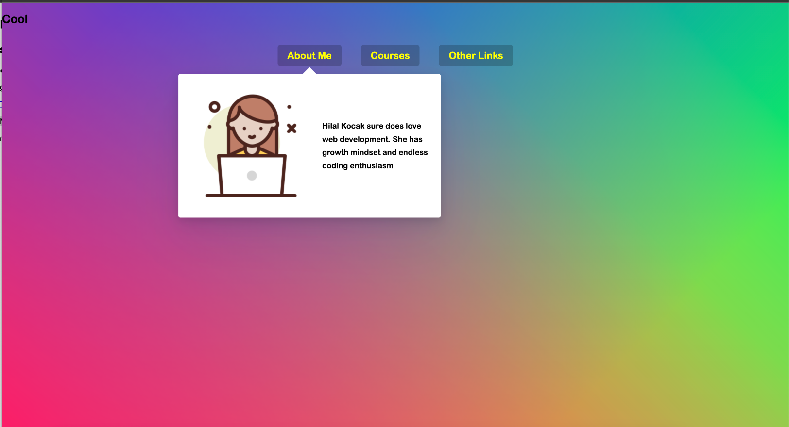

### Stripe Follow Along Nav
This project shows submenus with animation when user hover on the menu in navbar.

#### You can try this app with the link:
https://javascript30challenge-day26.netlify.app/

#### This is the preview of the application:

#### When stripe along the nav:

