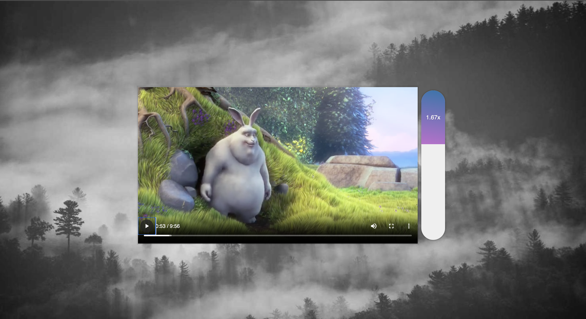
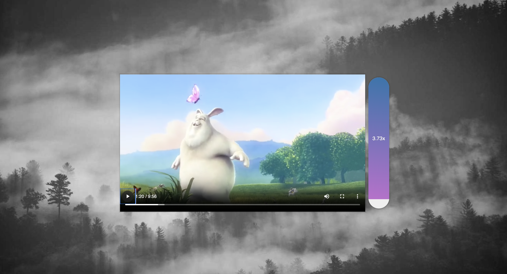

### Video Speed Controller UI
- This project allows user to arrange video playback rate between 0.4x and 4x

#### You can try this app with the link:
https://javascript30challenge-day28.netlify.app/

#### This is the preview of the application:

#### And the other one:

