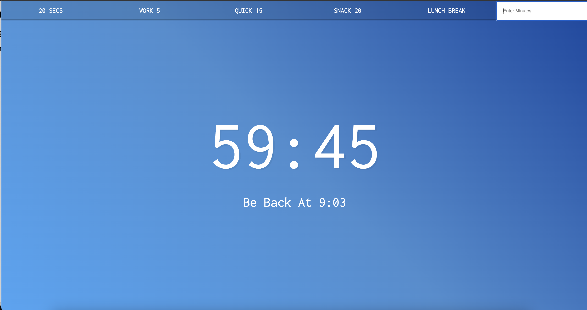
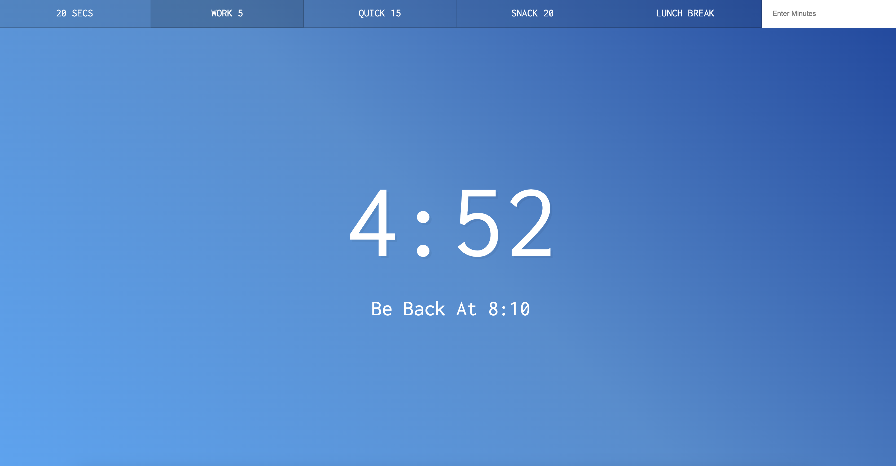

### Countdown Timer
- This project allows users to set a countdown timer for themselves. Users can start the timer by either typing the desired time or clicking the preset buttons.

#### You can try this app with the link:
https://javascript30challenge-day29.netlify.app/

#### This is the preview of the application:

#### When user clicks the button:

