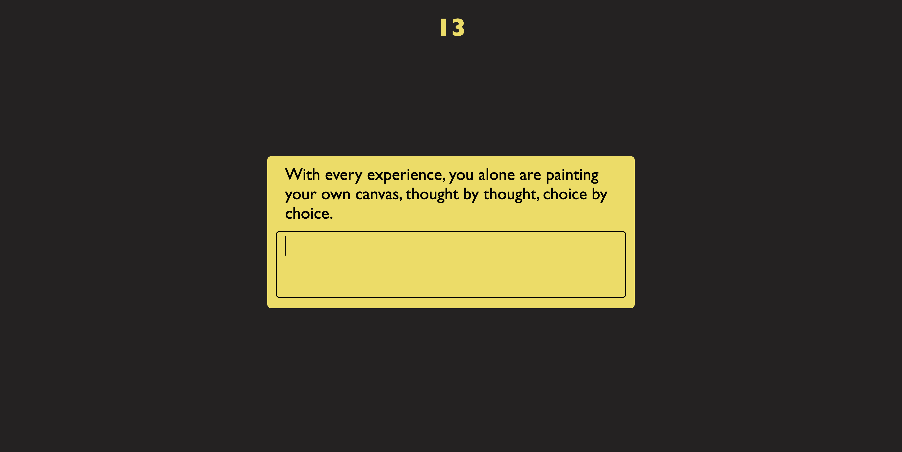
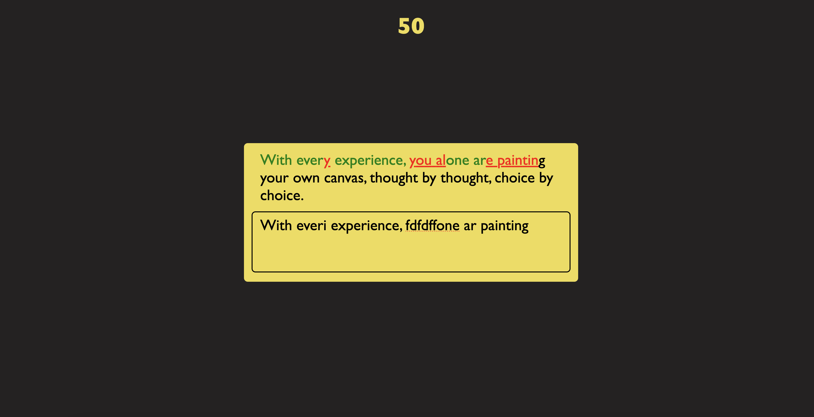

### Build a Speed Typing Game
This project measures typing speed of users. Also user can see their typing is correct with green color and incorrect with red color.
- The Random Quote API(https://api.quotable.io/random) used to get a different quote every time.

#### You can try this app with the link:
https://javascript31challenge-day31.netlify.app/

#### This is the preview of the application:

#### When user starts typing:

