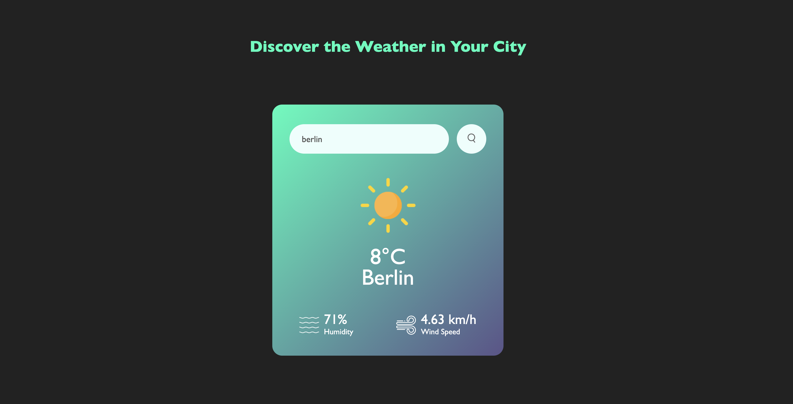

### Weather App
Enter the city which you want to learn weather conditions. This app allows user to see temperature, humidity and wind speed.
- [Open weather API](https://openweathermap.org/) used to get weather information

#### You can try this app with the link:
https://javascript-challenge-32.netlify.app/

#### This is the preview of the application:

#### When user enter the city name

