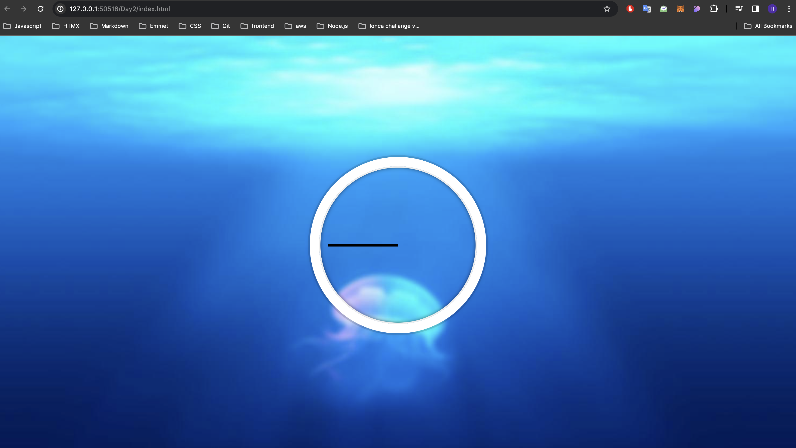

### Day 2 is about moving the clock dials correctly using Javascript.
#### In the starting file of Day 2, the clock's dials do not move and look like this:

### My updates
- The sudden jump error that occurred when the second hand reached 12 o'clock was fixed by temporarily turning off the transition feature.
- Bell button added. The clock started making a ticking sound when the bell button was pressed.
