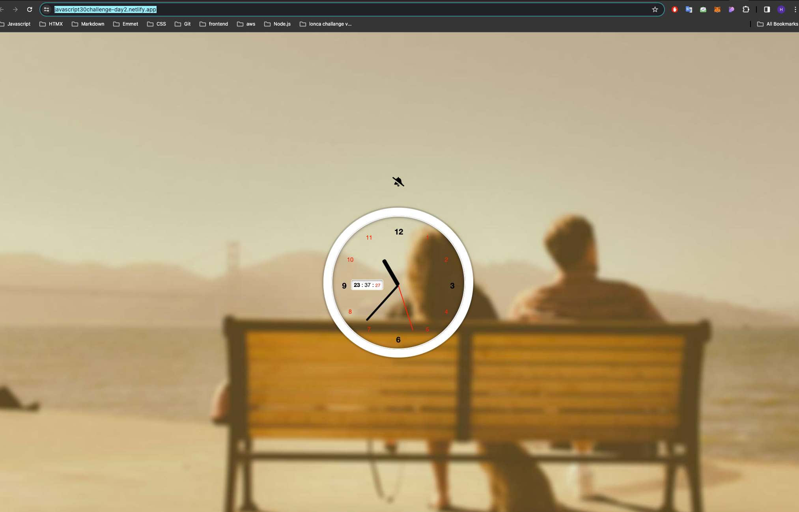

### Day 2 is about moving the clock dials correctly using Javascript.
#### In the starting file of Day 2, the clock's dials do not move and look like this:

### My updates
- The sudden jump error that occurred when the second hand reached 12 o'clock was fixed by temporarily turning off the transition feature.
- Bell button added. The clock started making a ticking sound when the bell button was pressed.
- Modified looks of the hands with changing css properties
- Added little digital timer on the clock
- If you want to try the app visit the link:
https://javascript30challenge-day2.netlify.app/

#### After my updates app looks like this:
